

  
<h1 align="center">UniTray</h1>

  
  

  

## Table of Contents
<!-- vim-markdown-toc GFM -->
* [About](#-about)
* [Features](#-features)
* [Prerequisites](#-prerequisites)
* [Installation](#-installation)
* [Usage](#%EF%B8%8F-usage)
* [Acknowledgements](#-acknowledgements)
* [Contributing](#-contributing)
* [License](#-license)
<!-- vim-markdown-toc GFM -->

<h2>❔ About</h2>

  UniTray is a lightweight PowerShell tray application that helps you monitor and update <a href="https://scoop.sh">Scoop</a>, <a href="https://chocolatey.org/">Chocolatey</a> and <a href="https://github.com/microsoft/winget-cli">WinGet</a> packages effortlessly, all from one simple application. 
  It runs in the background, checks for updates, and notifies you when new versions are available.

<h2>🚀 Features</h2>

  

    

      Periodically checks for updates, with a one-click update option in the context menu
    

    <table>
      <tr>
        <td align="center">
          <a title="Context Menu">
            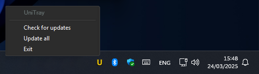 
            <b>Context Menu</b>
          </a>
        </td>
      </tr>
    </table>
  

  

    

      Runs in the system tray for easy access, with tooltip information
    

    <table>
      <tr>
        <td align="center">
          <a title="Tooltip">
            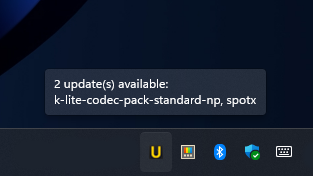 
            <b>Tooltip</b>
          </a>
        </td>
      </tr>
    </table>
  

  

    
Supports selective updates

    <table>
      <tr>
        <td align="center">
          <a title="Updates">
            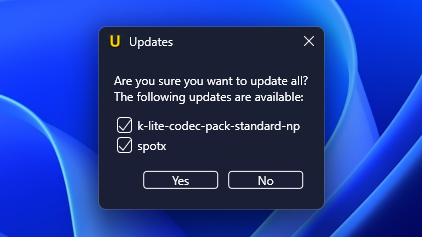 
            <b>Updates</b>
          </a>
        </td>
      </tr>
    </table>
  

  

    

      Terminates<a href="#terminates">[1]</a> package applications to allow updates
    

    <table>
      <tr>
        <td align="center">
          <a title="Termination">
            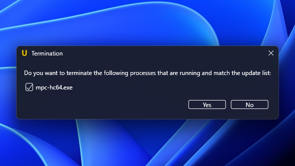 
            <b>Termination</b>
          </a>
        </td>
      </tr>
    </table>
  

  

    

      Sends failure notifications using <a href="https://github.com/Windos/BurntToast">BurntToast</a>
    

    <table>
      <tr>
        <td align="center">
          <a title="Failure">
            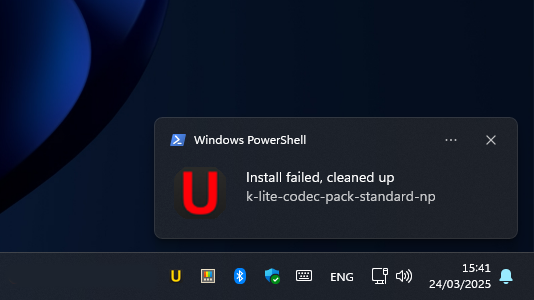 
            <b>Failure</b>
          </a>
        </td>
        <td align="center">
          <a title="Error">
            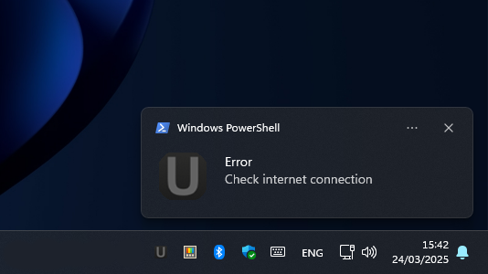 
            <b>Error</b>
          </a>
        </td>
      </tr>
    </table>
  

  

    

      Supports backdrop and dark mode integrations
    

    <table>
      <tr>
        <td colspan="3" align="center">
          <b>Backdrop</b>
        </td>
      </tr>
      <tr>
        <th align="center">
          <b>Type</b>
        </th>
        <th align="center">
          <b>Light</b>
        </th>
        <th align="center">
          <b>Dark</b>
        </th>
      </tr>
      <tr>
        <td align="center">
          <a title="Acrylic">
            Acrylic
          </a>
        </td>
        <td align="center">
          <a title="Acrylic Light">
            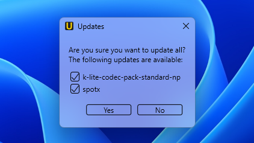 
          </a>
        </td>
        <td align="center">
          <a title="Acrylic Dark">
            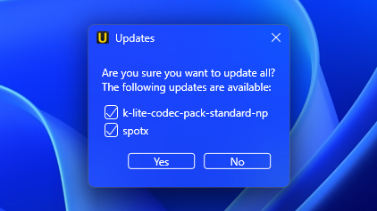 
          </a>
        </td>
      </tr>
      <tr>
        <td align="center">
          <a title="Mica">
            Mica
            <b>(Default)</b>
          </a>
        </td>
        <td align="center">
          <a title="Mica Light">
            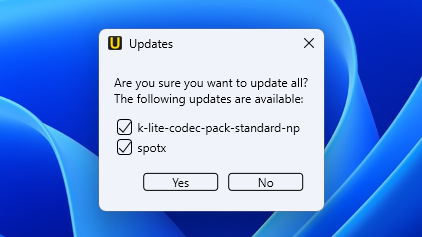 
          </a>
        </td>
        <td align="center">
          <a title="Mica Dark">
             
          </a>
        </td>
      </tr>
      <tr>
        <td align="center">
          <a title="Mica Alt">
            Mica Alt
          </a>
        </td>
        <td align="center">
          <a title="Mica Alt Light">
            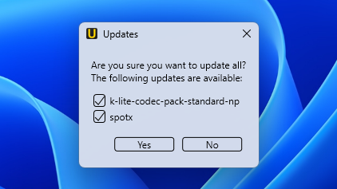 
          </a>
        </td>
        <td align="center">
          <a title="Mica Alt Dark">
            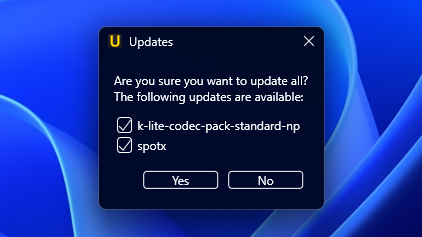 
          </a>
        </td>
      </tr>
    </table>
     
    <table>
      <tr>
        <td colspan="2" align="center">
          <b>Theme</b>
        </td>
      </tr>
      <tr>
        <th align="center">
          <b>Light</b>
        </th>
        <th align="center">
          <b>Dark</b>
        </th>
      </tr>
      <tr>
        <td align="center">
          <a title="Light">
            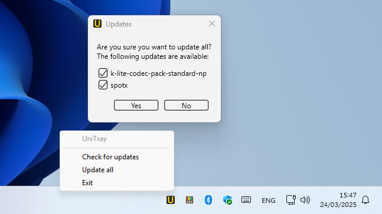 
          </a>
        </td>
        <td align="center">
          <a title="Dark">
            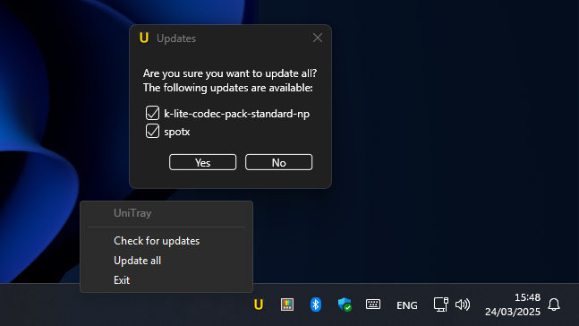 
          </a>
        </td>
      </tr>
    </table>
  

> [!NOTE]  
> Backdrop and dark mode integrations are only supported on Windows builds 22000+

  <strong>[1]</strong>
   
    To allow Scoop package updates, applications currently in use must be closed. It is highly recommended to ensure programs are idle and that no unsaved progress exists before termination.
   
    If you prefer to close applications manually, do so before running updates.

<h2>📚 Prerequisites</h2>

  <ul>
    <li>
      A Package Manager (<a href="https://scoop.sh">Scoop</a>, <a href="https://chocolatey.org/">Chocolatey</a> or/and <a href="https://github.com/microsoft/winget-cli">WinGet</a>)
    </li>
    <li>
      <a href="https://github.com/Windos/BurntToast">BurntToast</a>
    </li>
    <li>
      <a href="https://www.powershellgallery.com/packages/Microsoft.WinGet.Client">Microsoft.WinGet.Client</a>
    </li>
  </ul>
  To install BurntToast and <code>Microsoft.WinGet.Client</code>, run the following command in PowerShell:
  <pre><code>Install-Module -Name BurntToast, Microsoft.WinGet.Client</code></pre>

<h2>📥 Installation</h2>

  To start using UniTray:
  <ol>
    <li>
      Clone the repository:
      <pre><code>git clone https://github.com/WildeBeast2521/UniTray.git</code></pre>
    </li>
    <li>
      Run the following command in Command Prompt (CMD) to start UniTray:
      <pre><code>PowerShell.exe -ExecutionPolicy Bypass -File UniTray.ps1</code></pre>
    </li>
  </ol>

<h2>🛠️ Usage</h2>

  Timer interval and backdrops can be set in the <code>settings.json</code> file created on initial start.
  <h3>Timer Interval</h3>
  The default check interval is set to <b>2 hours</b>. To customize it, set the <code>interval</code> value in settings.

  <h3>Backdrop</h3>
  The default backdrop is set to <b>Mica</b>. To customize it, set the <code>backdrop</code> value in the settings with the appropriate constant. <a href="https://learn.microsoft.com/en-us/windows/win32/api/dwmapi/ne-dwmapi-dwm_systembackdrop_type">Constants</a> for backdrops are defined below:
  <table>
    <tr>
      <th align="center">
        <b>Backdrop</b>
      </th>
      <th align="center">
        <b>Constant</b>
      </th>
    </tr>
    <tr>
      <td align="center">
        <a title="Mica">
          Mica <b>(Default)</b>
        </a>
      </td>
      <td align="center">
        <a title="Mica_Constant">
          <code>2</code>
        </a>
      </td>
    </tr>
    <tr>
      <td align="center">
        <a title="Acrylic">
          Acrylic
        </a>
      </td>
      <td align="center">
        <a title="Acrylic_Constant">
          <code>3</code>
        </a>
      </td>
    </tr>
    <tr>
      <td align="center">
        <a title="Mica Alt">
          Mica Alt
        </a>
      </td>
      <td align="center">
        <a title="MicaAlt_Constant">
          <code>4</code>
        </a>
      </td>
    </tr>
  </table>

<h2>🙌 Acknowledgements</h2>

  UniTray has evolved through a lot of edits, from a simple tray application into a customizable update manager, with help from various sources:
  <ol>
    <li>
      <a href="https://github.com/dongle-the-gadget/SystemBackdropTypes">dongle-the-gadget/SystemBackdropTypes</a> / <a href="https://tvc-16.science/mica-wpf.html">Apply Mica to a WPF app on Windows 11</a> for backdrop integration
    </li>
    <li>
      <a href="https://gist.github.com/rounk-ctrl/b04e5622e30e0d62956870d5c22b7017">Win32 Dark Mode</a> / <a href="https://www.wxwidgets.org/wxWidgets/src/msw/darkmode.cpp">Support for dark mode in wxMSW</a> for Dark mode support
    </li>
  </ol>
  And more!

<h2>🔧 Contributing</h2>

  Pull requests are welcome - check out <a href="https://github.com/WildeBeast2521/UniTray/blob/main/CONTRIBUTING.md">CONTRIBUTING</a> for more information

<h2>📄 License</h2>

  This project is licensed under the MIT License - see the <a href="./LICENSE">MIT License</a> file for details.

